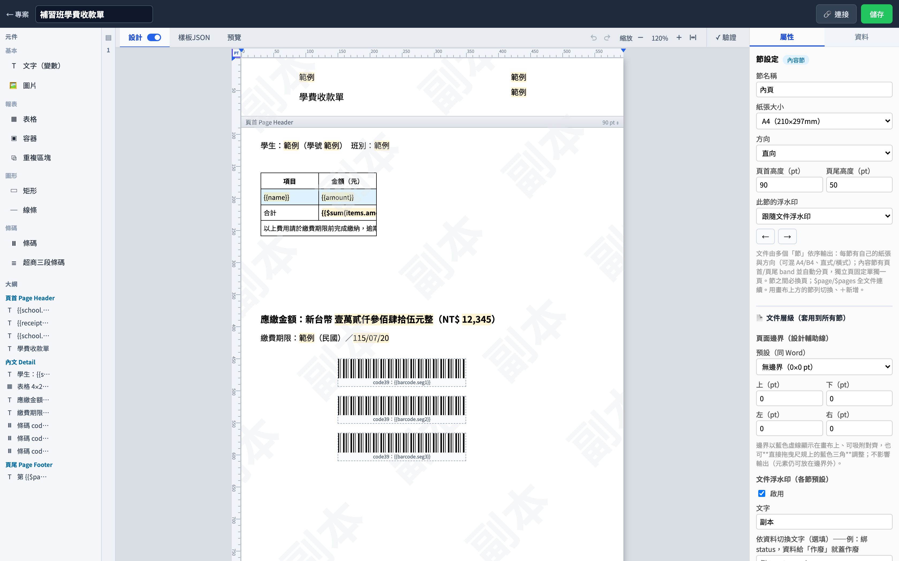
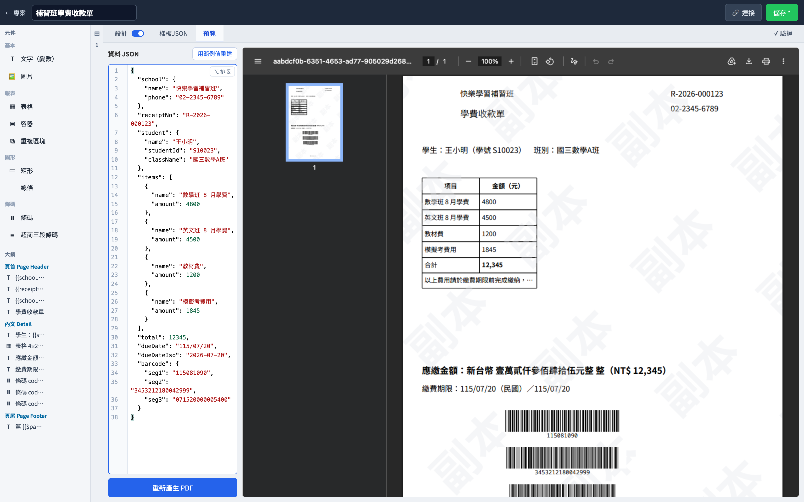

# PDF 樣板編輯器

在瀏覽器裡拖拉設計單據樣板，送資料進來就產出 PDF。

這是一套為「收款單、繳費單、收據」這類台灣常見單據打造的開源工具：設計人員在網頁編輯器裡排版面（文字、表格、條碼、圖片、印章浮水印），系統串接方只要把資料丟給它，就能拿到一份排好版的正式 PDF。

## 它能做什麼

- **像簡報軟體一樣設計單據**：拖拉元件、對齊、調字型字級，畫面上看到什麼，印出來就是什麼。
- **資料與版面分離**：版面上放的是「欄位」（例如客戶名稱、金額、日期），實際內容由送進來的資料決定。同一份樣板可以印出千百張不同內容的單據。
- **明細表格自動長**：一筆訂單有 3 行明細或 300 行都沒問題，表格自動換頁、每頁重畫表頭，還能做分組小計。
- **台灣單據的細節都有**：金額國字大寫（壹拾貳萬…元整）、民國年日期、超商繳費三段條碼、中一刀／熱感紙張尺寸、「作廢」印章浮水印。
- **嵌進你自己的系統**：編輯器可以用 iframe 嵌入任何網頁系統，讓你的使用者在你的產品裡設計樣板；你的後端再呼叫 API 產出 PDF。
- **多人團隊管理**：內建登入、專案、成員權限，設計者各管各的樣板。

## 畫面

在編輯器裡設計收款單樣板（拖拉元件、頁首頁尾、浮水印）：



送一份資料進去，即時預覽產出的 PDF（明細表格、金額國字大寫、超商三段條碼）：



## 快速開始

只需要安裝 [Docker](https://www.docker.com/)：

```bash
docker compose up -d --build
```

然後打開 http://localhost:8090，用預設管理員帳號 **`admin` / `admin1234`** 登入（定義在 `docker-compose.yml`），就能開始建立專案與設計樣板。

> ⚠️ 預設帳密與 `SESSION_SECRET` 僅供本機試用，**對外部署前務必修改**。

## 想串接到自己的系統？

編輯器內建「🔗 連接」按鈕，會產生一份帶著你實際樣板編號的串接說明（前端嵌入、後端產 PDF 各一份，可直接複製給工程師）。更完整的整合指南在 [docs/embed.md](docs/embed.md)。

## 文件

- [功能總覽與文件索引](docs/README.md)
- [編輯器功能](docs/editor.md)｜[渲染引擎](docs/engine.md)｜[HTTP API](docs/api.md)｜[嵌入整合](docs/embed.md)
- 想參與開發？請看 [CONTRIBUTING.zh.md](CONTRIBUTING.zh.md)，開發環境與架構細節在 [CLAUDE.md](CLAUDE.md)。

## 授權

[MIT](LICENSE) — 可自由使用、修改、商用。
