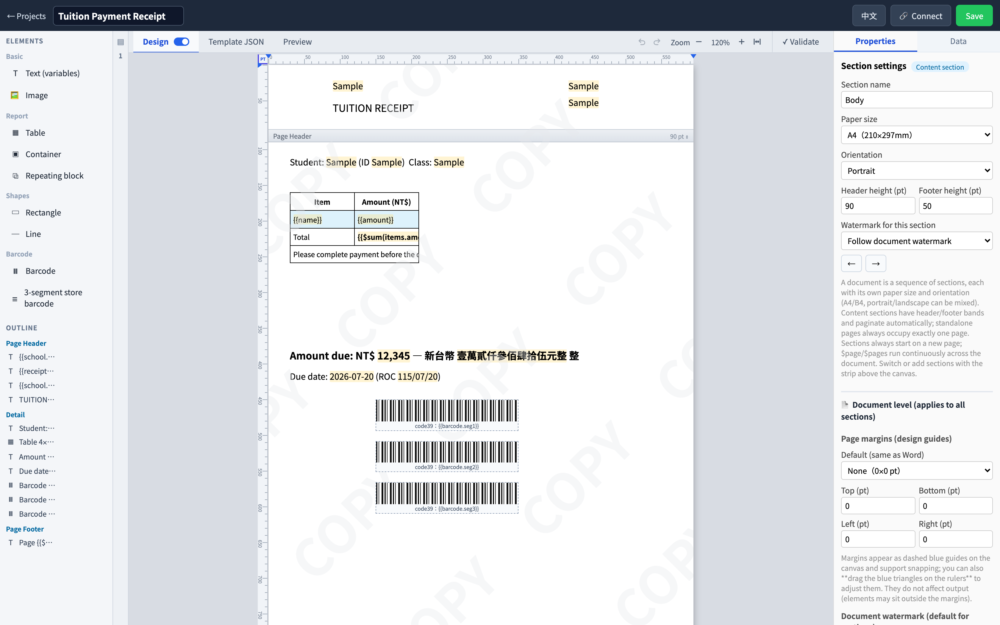
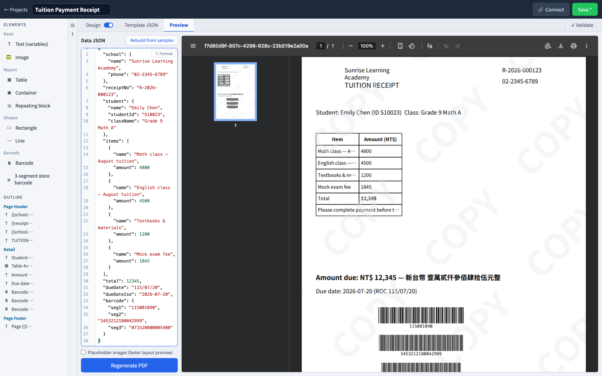

# PDF 樣板編輯器 + 報表引擎

[English](README.md) | 繁體中文

這是一套通用的 PDF 產生器：你在瀏覽器裡把版面排好（文字、資料欄位、表格、條碼、圖片都能拖），存成樣板；之後系統只要把資料丟過來，就能拿到一份排好版的 PDF。

編輯器可以用 iframe 嵌進你自己的系統，讓使用者在你的產品裡設計樣板；產 PDF 則是你的後端呼叫一支 API 的事。前端只負責設計和預覽，真正畫 PDF 的一律是後端的 Go 引擎，所以預覽看到什麼，正式輸出就是什麼。

> 這是個娛樂性質的 side project，功能一定還缺很多，歡迎直接提 PR，或開 Feature issue 告訴我你想要什麼。

| 編輯器 | 預覽 |
|:---:|:---:|
|  |  |
|  |  |

## Quick Start

你只需要裝好 [Docker](https://www.docker.com/)：

```bash
git clone https://github.com/zerox12311/pdf-report.git
cd pdf-report
cp .env.example .env        # 想改帳密或 port 就改這裡，不改也能直接跑
docker compose up -d --build
```

接下來照著走一遍：

**1. 登入。** 打開 http://localhost:8090，預設帳號是 `admin`、密碼 `admin1234`。

**2. 設計一張樣板。** 建一個專案、新增樣板，就會進到編輯器。左側的元件盤可以把文字、表格、條碼拖到畫布上。要放「渲染時才填進來」的內容，就用「資料欄位」元件，key 填像 `customer.name` 這樣的路徑就好。

**3. 預覽看看。** 切到上方的「預覽」分頁，左邊貼一份資料 JSON（懶得寫可以按「用範例值重建」），右邊馬上會出現後端渲染的真實 PDF。

**4. 從你的系統產 PDF。** 到專案設定頁簽一把 API key，然後把資料 POST 到 render API：

```bash
curl -X POST "http://localhost:8090/api/templates/<樣板id>/render" \
  -H "Authorization: Bearer pdftpl_你的金鑰" \
  -H "Content-Type: application/json" \
  -d '{"data": {"customer": {"name": "王小明"}}}' \
  -o out.pdf
```

不想自己拼請求的話，編輯器右上角有個「🔗 連接」按鈕，會幫你產生一份已經代入實際樣板 id 的串接說明（連 iframe 嵌入的寫法都有），直接複製給工程師就行。

> ⚠️ 預設帳密和 `SESSION_SECRET` 只是讓你在本機玩的，要對外部署前請務必改掉，下一節有說明。

## 環境變數

Quick Start 複製出來的 `.env` 會被 `docker compose` 自動讀進去。每個變數都有預設值，所以什麼都不改也能跑；想調的時候對照這張表（[.env.example](.env.example) 裡也有逐項註解）：

| 變數 | 預設 | 用途 |
|---|---|---|
| `APP_PORT` | `8090` | 服務對外的 port |
| `ADMIN_USER` / `ADMIN_PASSWORD` | `admin` / `admin1234` | 第一次啟動時建立的管理員。只在使用者表還是空的時候會建，之後直接在控制台改密碼就好 |
| `SESSION_SECRET` | `change-me-in-production` | 用來簽登入 session 和嵌入 token 的金鑰。對外部署一定要換成隨機值，例如 `openssl rand -hex 32` |
| `POSTGRES_PASSWORD` | `pdftpl` | 資料庫密碼，app 的連線字串會自動跟著用同一個值 |
| `CORS_ORIGINS` | 空（只允許同源） | 跨網域白名單，用逗號分隔；填 `*` 是全開，只建議 demo 用。如果你的前端要從別的網域直接呼叫 API，把那個網域填進來 |

如果你不用 Docker、想自己跑後端，還有 `PORT`、`DATABASE_URL`、`STORAGE_ROOT`、`FONTS_DIR`、`WEB_ROOT` 這些變數可以設，細節在 [CLAUDE.md](CLAUDE.md) 的架構說明裡。

## 想看更多

- 想參與開發，或是想了解專案怎麼組起來的：從 [CLAUDE.md](CLAUDE.md) 開始。它同時也是給 AI 協作工具看的說明書，架構、常用指令、不能踩的規矩、踩過的坑都在裡面。
- 想知道每個功能目前的行為：看 [docs/](docs/README.md)，分成[編輯器](docs/editor.md)、[渲染引擎](docs/engine.md)、[HTTP API](docs/api.md)、[iframe 嵌入](docs/embed.md)四份。
- 樣板 JSON 的 schema 以程式碼為準：`frontend/src/app/core/models/template.model.ts` 和 `backend/internal/engine/models.go`，兩邊永遠一起改。

## 部署上的幾件事

- 整套東西是一個 app 容器加一個 Postgres。前端和 `/api` 同源，不用另外架反向代理；`/healthz` 可以拿來做健康檢查。
- Postgres 開在 :5442（避開本機常見的 5432），資料在 `pg-data` volume；上傳的圖片和字型放在 `pdf-storage` volume。
- 想看嵌入是什麼樣子，直接用瀏覽器打開 [docs/embed-example.html](docs/embed-example.html)。
- 本機開發（前端 :4300 proxy 到後端 :5043、怎麼跑測試、怎麼 build）見 [CLAUDE.md](CLAUDE.md) 的「常用指令」。

## 技術棧

- `frontend/`：Angular 20（standalone、signals、OnPush），編輯器的版面參考 JasperReports。
- `backend/`：Go + Gin + PostgreSQL/GORM，PDF 靠 [gopdf](https://github.com/signintech/gopdf)，條碼靠 boombuler/barcode。渲染的唯一權威是 `internal/engine`，前端預覽也是呼叫它。

## 關於字型

內建的 Noto 字型放了兩份：`backend/fonts` 給 PDF 嵌入用（gopdf 會自動 subset），`frontend/public/fonts` 給畫布顯示用，這樣設計時看到的才會接近輸出。它們是 Noto 系列的修改版（做過子集化和假斜體），依 **SIL OFL 1.1** 散布，授權文字在 [backend/fonts/OFL.txt](backend/fonts/OFL.txt)，其他第三方元件列在 [THIRD_PARTY_NOTICES.md](THIRD_PARTY_NOTICES.md)。

為了控制體積，內建字型只裁了 Big5 常用漢字區（大約 5,400 字）加 ASCII 和全形標點，所以非常罕見的字可能會缺。需要更完整的覆蓋有兩條路：用 fonttools 的 `pyftsubset` 重新裁一份、兩邊一起換掉；或是直接在控制台匯入你自己的字型（`POST /api/fonts`）。
